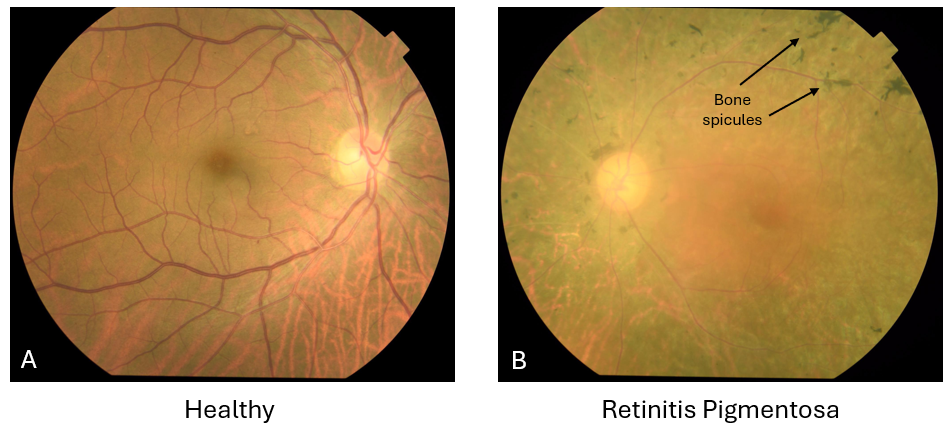
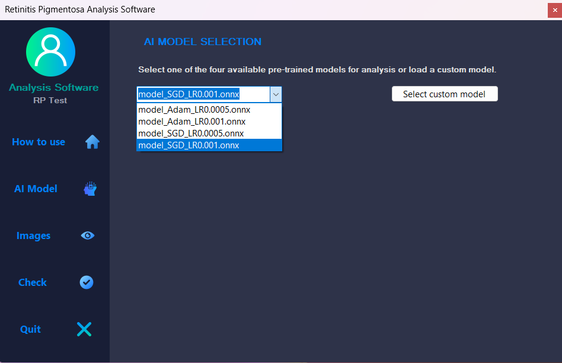
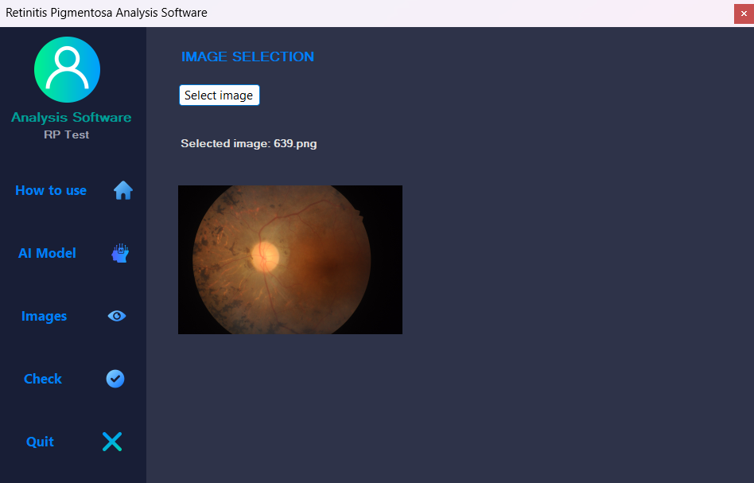
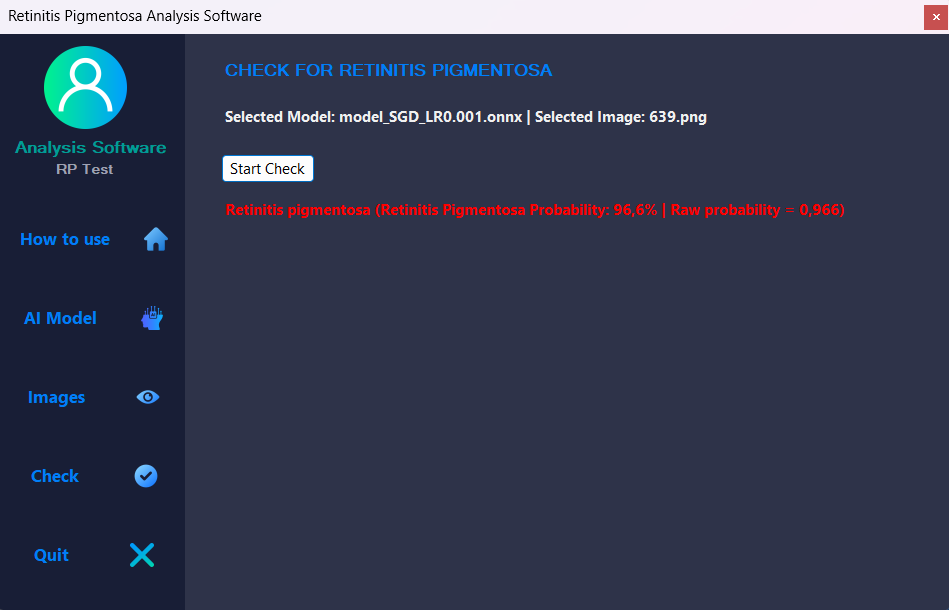

# Machine Learning-aided Diagnosis of Retinitis Pigmentosa

This repository contains the official experimental code, notebooks, and utilities associated with the scientific article:

**Machine Learning-aided diagnosis of retinitis pigmentosa**

## Authors
- Francesco Cappellani  
- Andrea Caruso (Corresponding Author)  
- Alessia Cosentino  
- Roberta Torrisi  
- Gabriella Lupo  
- Caterina Gagliano  
- Massimiliano Salfi  

## Mandatory Citation Notice

Any use of this repository, in whole or in part, for any purpose whatsoever (including but not limited to academic research, commercial applications, clinical research, software development, or derivative works) **MUST include a proper citation of the article _"Machine Learning-aided diagnosis of retinitis pigmentosa"_ and ALL listed authors**.

Failure to cite the article and authors constitutes a violation of the usage terms of this repository.

## Related Scientific Article

This repository supports the research presented in *Machine Learning-aided diagnosis of retinitis pigmentosa*, which investigates the application of machine learning and deep learning techniques for the automated classification of Retinitis Pigmentosa (RP) using retinal fundus images.

Based on the published study, multiple neural network architectures were evaluated on three independent datasets comprising a total of 248 RP fundus images and 1045 healthy control images. The experimental pipeline focused on mitigating class imbalance through targeted data augmentation and on optimizing model sensitivity (recall) for RP detection, which is critical in clinical screening scenarios. The selected models are intended for integration into a mutation-aware, AI-based Clinical Decision Support System (CDSS).

## Datasets

The experiments described in the article are based on three independent and publicly documented datasets:

### 1. RFMiD – Retinal Fundus Multi-Disease Image Dataset
A large-scale dataset containing fundus images labeled for multiple retinal diseases, including Retinitis Pigmentosa.

Official reference and access:  
https://doi.org/10.3390/data6020014

### 2. Color Fundus Images for Eye Disease Detection (Bangladesh Dataset)
A dataset collected from Anawara Hamida Eye Hospital and B.N.S.B. Zahurul Haque Eye Hospital (Faridpur, Bangladesh), including fundus images of several ocular diseases, among which Retinitis Pigmentosa.

Official reference and access:  
https://doi.org/10.1016/j.dib.2024.110979

### 3. RIPS – Retinal Images for Pigment Signs Dataset
A dataset specifically focused on Retinitis Pigmentosa, designed for the analysis of pigment signs in retinal fundus images.

Official reference:  
https://doi.org/10.1016/j.neucom.2018.04.065

## Repository Contents

### Jupyter Notebook Google Colab Experiments

This folder contains all experiments described in the associated article, implemented as Jupyter Notebooks designed to run on Google Colab.

The notebooks include:
- Dataset loading and preprocessing
- Data augmentation strategies for class imbalance handling
- Comparison of multiple neural network architectures (Binary Classifier, ConvNeXt, ResNet, EfficientNet, and custom CNNs)
- Hyperparameter optimization (optimizers, learning rates, schedulers)
- Training, validation, and test evaluation
- Performance analysis using confusion matrices, ROC curves, and Precision–Recall curves

All notebooks are freely downloadable, modifiable, and executable in the Google Colab environment.

### PT to ONNX Model Converter

This folder contains a Python script that allows conversion of trained artificial intelligence models from PyTorch format (`.pt`) to ONNX format (`.onnx`).

The converter is intended to support cross-platform deployment, model portability, and integration into external inference tools outside the PyTorch ecosystem.

## Additional Resources (Google Drive)

The same files available in this repository, together with additional materials, can be accessed at the following Google Drive link:

https://drive.google.com/drive/folders/1h8JBL9VFNns4xiifs3-8QyxCR--Wv9es?usp=sharing

The Google Drive repository additionally includes:

- Four trained artificial intelligence models, provided both in PyTorch (`.pt`) and ONNX (`.onnx`) formats
- A Windows-based inference tool

### Windows Inference Tool – Example Screenshots

The Windows inference tool allows users to:
1. Select one of the available ONNX models or import a custom ONNX model, including models re-trained starting from those provided
2. Load a retinal fundus image (either a healthy control or an image affected by Retinitis Pigmentosa)
3. Perform inference to classify the image as Healthy (Control) or Retinitis Pigmentosa (RP)

Below are example screenshots of the Windows-based inference tool included in the Google Drive resources.

#### Model selection

#### Fundus image selection

#### Inference result

## Intended Use

This repository is intended for research, educational, and development purposes in the fields of medical imaging, ophthalmology, artificial intelligence, and clinical decision support systems. The provided code and models are not intended to replace professional medical diagnosis.

## Contact

Corresponding Author:  
Andrea Caruso  
Email: andrea.caruso@phd.unict.it
